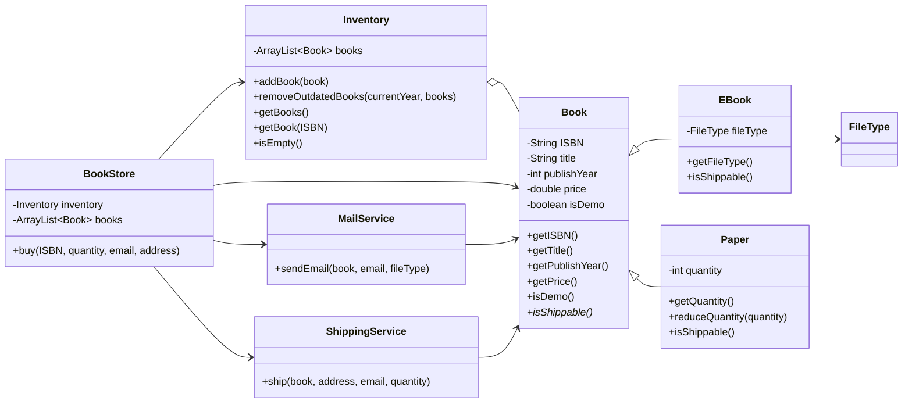
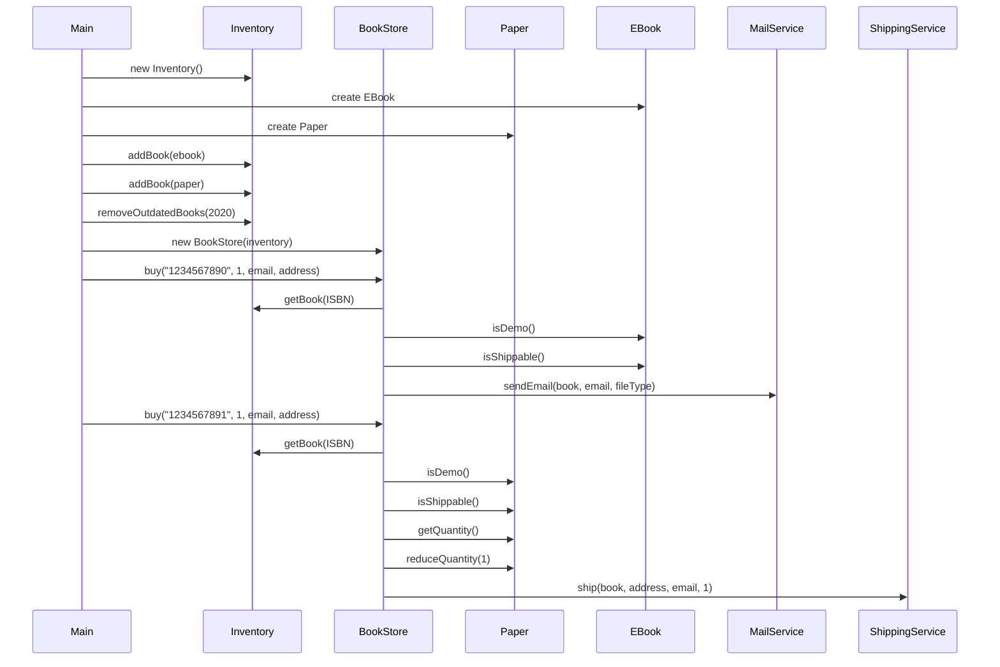

# 📚 Fawry Quantum Bookstore

A simple Java-based bookstore system that supports both **paper books** and **eBooks**. The system allows for adding books to inventory, removing outdated books, and processing purchases with delivery (either shipping or email).

---
## Screenshots from my running app
---


---

## 🧠 Project Structure

```
Fawry-Quantum-Bookstore/
├── Main.java                     // Entry point of the application
├── bookStore/
│   └── BookStore.java            // Main store logic (buying books, connecting inventory and services)
├── inventory/
│   └── Inventory.java            // Handles storage and management of books
├── models/
│   ├── Book.java                 // Abstract base class for all book types
│   ├── Paper.java                // Represents a physical book
│   ├── EBook.java                // Represents a digital book
│   └── FileType.java             // Enum for eBook formats (PDF, EPUB, MOBI)
├── services/
│   ├── MailService.java          // Handles email delivery for eBooks
│   └── ShippingService.java      // Handles physical shipping for paper books
```

---

## 🚀 Features

- Add physical and digital books to inventory  
- Remove outdated books (older than 20 years)  
- Buy books:
  - Email delivery for eBooks  
  - Shipping for paper books  
- Prevents purchase of demo books  
- Tracks quantity of physical books  

---

## 🛠️ Classes Overview

### `Book` (Abstract)
- Fields: `ISBN`, `title`, `publishYear`, `price`, `isDemo`
- Abstract method: `isShippable()`

### `Paper` (extends `Book`)
- Fields: `quantity`
- `isShippable() → true`

### `EBook` (extends `Book`)
- Fields: `fileType`
- `isShippable() → false`

### `Inventory`
- Stores books
- Adds/removes/fetches books
- Removes books older than 20 years

### `BookStore`
- Buys books by ISBN
- Differentiates between shippable and emailable books
- Uses `ShippingService` and `MailService`

### `ShippingService`
- `ship(Book book, String address, String email, int quantity)`

### `MailService`
- `sendEmail(Book book, String email, FileType fileType)`





